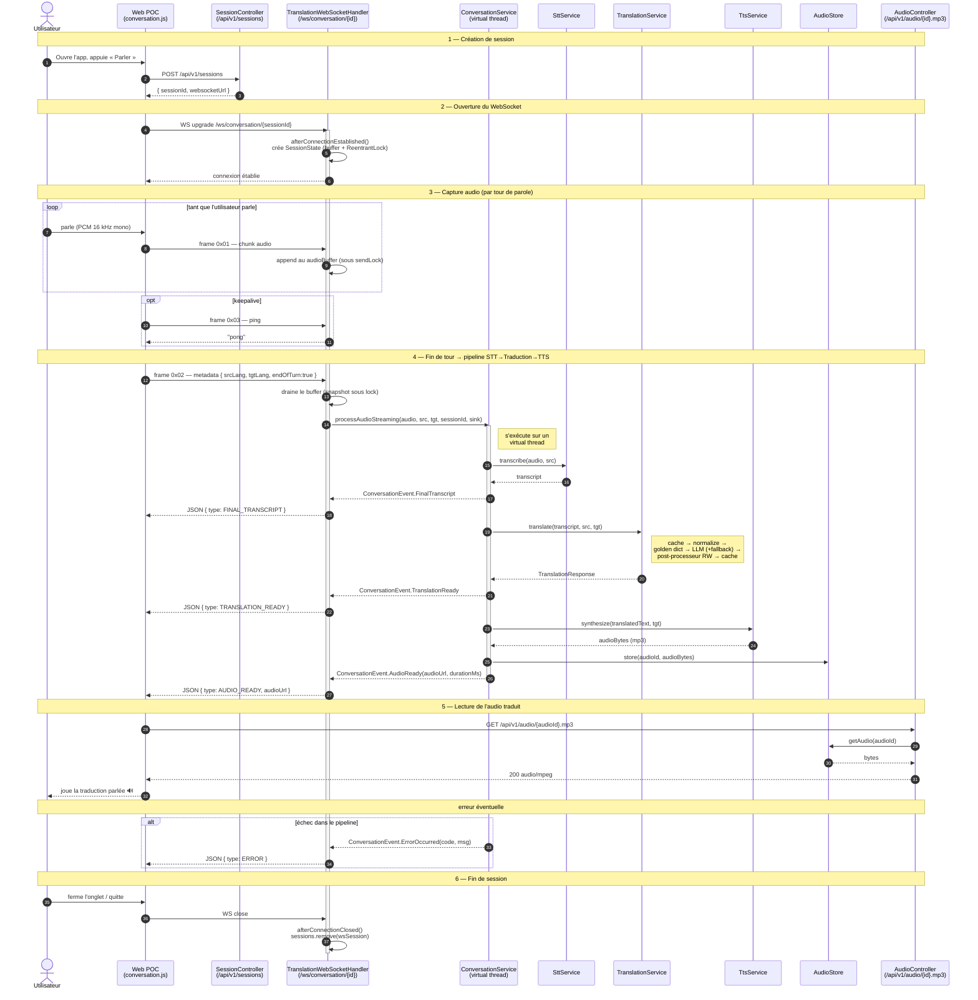

# 🏗️ ARCHI — Tuganire MVP

**Architecture Document**
**Version** : 1.1
**Date** : Mai 2026
**Stack cible** : Spring Boot 4.0 + Java 21 + Spring AI 2.0-M4 + Kotlin Compose + Thymeleaf

---

## 1. 🎯 Principes architecturaux

### Les 5 principes directeurs

1. **🔌 Modularité par interfaces** : tous les fournisseurs externes (LLM, STT, TTS) sont derrière des interfaces — switchables sans réécriture
2. **🛡️ Le LLM ne décide pas seul** : couche de post-processing avec règles natives + dictionnaire d'or
3. **⚡ Java 21 features modernes** : records, sealed interfaces, virtual threads, pattern matching
4. **🌐 Backend unifié, clients multiples** : un seul backend Spring Boot sert l'app Android, le web, et l'API publique future
5. **📊 Boucle de feedback** : capture des corrections natives pour amélioration continue

### Anti-patterns explicitement évités

- ❌ Wrapper LLM pur (sans couche d'expertise native) → le LLM échoue sur 5 catégories d'erreurs documentées
- ❌ Microservices prématurés → monolithe modulaire suffit au MVP
- ❌ WebFlux réactif → over-engineering, virtual threads Java 21 suffisent
- ❌ Architecture hexagonale dogmatique → simple package layering pragmatique
- ❌ Stockage local sensible → tout en backend pour pouvoir évoluer côté serveur

---

## 2. 🏛️ Vue d'ensemble C4

### C4 Niveau 1 — Context

```
┌──────────────────────────────────────────────────────────────────┐
│                          UTILISATEURS                              │
│                                                                    │
│   👤 Marc (voyageur FR)            👤 Mukamana (locale RW)        │
└────────────────┬─────────────────────────────────┬───────────────┘
                 │                                  │
                 ▼                                  ▼
        ┌──────────────────┐              ┌────────────────────┐
        │  App Android     │              │  Web POC           │
        │  (Kotlin Compose)│              │  (Thymeleaf+HTMX)  │
        └────────┬─────────┘              └─────────┬──────────┘
                 │                                   │
                 └─────────────┬─────────────────────┘
                               │ HTTPS / WebSocket
                               ▼
              ┌──────────────────────────────────────┐
              │   🎯 TUGANIRE BACKEND                 │
              │   Spring Boot 4.0 + Java 21          │
              │   Spring AI 2.0-M4 (cutting edge)    │
              └────┬──────────┬──────────┬───────────┘
                   │          │          │
       ┌───────────┘          │          └────────────┐
       ▼                      ▼                       ▼
  ┌─────────┐         ┌─────────────┐        ┌──────────────┐
  │ OpenAI  │         │ MMS-TTS     │        │  Redis Cache │
  │ APIs    │         │ (VPS GPU)   │        │              │
  └─────────┘         └─────────────┘        └──────────────┘
   GPT-5 / GPT-4o    facebook/mms-tts-kin    Traductions
   Whisper           facebook/mms-tts-fra    fréquentes
   TTS (option)
```

### C4 Niveau 2 — Containers

| Container | Tech | Responsabilité |
|-----------|------|----------------|
| **App Android** | Kotlin, Jetpack Compose, OkHttp | UI mobile, capture audio, lecture TTS |
| **Web POC** | Thymeleaf, Tailwind 4, HTMX, Alpine | UI web, démo, validation communautaire |
| **Backend monolithe** | Spring Boot 4.0, Java 21, Spring AI 2.0-M4 | Orchestration STT/Translation/TTS, API Versioning natif |
| **TTS local server** | Python FastAPI, transformers | Serveur MMS-TTS (kinyarwanda + français) |
| **Redis** | Redis 7 | Cache traductions et sessions |
| **PostgreSQL** | PostgreSQL 16 | Dictionnaire d'or, feedback utilisateurs |

### C4 Niveau 3 — Composants du backend

```
┌────────────────────────────────────────────────────────────────┐
│                  TUGANIRE BACKEND (Spring Boot)                 │
│                                                                  │
│  ┌──────────────────────────────────────────────────────────┐  │
│  │            COUCHE PRÉSENTATION                            │  │
│  │  • RestController (API publique)                          │  │
│  │  • WebController (Thymeleaf templates)                    │  │
│  │  • WebSocketHandler (streaming temps réel)                │  │
│  └─────────────────────────┬────────────────────────────────┘  │
│                            │                                     │
│  ┌─────────────────────────▼────────────────────────────────┐  │
│  │            COUCHE SERVICES                                │  │
│  │  • ConversationService (orchestrateur principal)          │  │
│  │  • TranslationService                                     │  │
│  │  • SttService                                             │  │
│  │  • TtsService                                             │  │
│  │  • FeedbackService                                        │  │
│  └─────────────────────────┬────────────────────────────────┘  │
│                            │                                     │
│  ┌─────────────────────────▼────────────────────────────────┐  │
│  │            COUCHE TRADUCTION CORE                         │  │
│  │  • Normalizer (FR : argot → standard, hedges)             │  │
│  │  • GoldenDictionary (lookup phrases pré-validées)         │  │
│  │  • LlmTranslator (interface)                              │  │
│  │  • PostProcessor (5 règles correctives)                   │  │
│  └─────────────────────────┬────────────────────────────────┘  │
│                            │                                     │
│  ┌─────────────────────────▼────────────────────────────────┐  │
│  │            COUCHE PROVIDERS (interfaces)                  │  │
│  │  • SttProvider (Whisper, Web Speech, MMS-ASR)             │  │
│  │  • LlmProvider (GPT-4o, Claude, NLLB)                     │  │
│  │  • TtsProvider (MMS-TTS, OpenAI, ElevenLabs)              │  │
│  └─────────────────────────┬────────────────────────────────┘  │
│                            │                                     │
│  ┌─────────────────────────▼────────────────────────────────┐  │
│  │            COUCHE DONNÉES                                 │  │
│  │  • GoldenDictionaryRepo (JPA)                             │  │
│  │  • FeedbackRepo (JPA)                                     │  │
│  │  • TranslationCacheRepo (Redis)                           │  │
│  └────────────────────────────────────────────────────────────┘  │
└────────────────────────────────────────────────────────────────┘
```

---

## 3. 🛠️ Stack technique détaillée

### Backend

| Composant | Choix | Version | Justification |
|-----------|-------|---------|---------------|
| **JVM** | OpenJDK Temurin | 21 LTS | Records, virtual threads, pattern matching |
| **Framework** | Spring Boot | **4.0.6** | API Versioning natif, `@HttpExchange` clients typés, OpenTelemetry intégré |
| **Spring Framework** | Spring Framework | 7.0.4 | Null-safety JSpecify, Jakarta EE 11 baseline |
| **IA framework** | Spring AI | **2.0.0-M4** | Milestone, GA imminente. SDK OpenAI officiel, intégration Anthropic refondée, MCP en core |
| **Build** | Maven | 3.9+ | Cohérent avec expérience Fabrice |
| **Tests** | JUnit 5, Mockito, Testcontainers, Spring Test | latest | Standard |
| **Persistance** | Spring Data JPA + Hibernate 6 | latest | Standard pour PostgreSQL |
| **Cache** | Spring Data Redis (Lettuce) | latest | Cache traductions fréquentes |
| **JSON** | Jackson 3 (`tools.jackson`) | 3.x | **Nouveau dans Spring Boot 4** (Jackson 2 deprecated) |
| **Null-safety** | JSpecify (`@NonNull`, `@Nullable`) | latest | Standardisé dans Spring 7, vérifié au compile-time |
| **API doc** | SpringDoc OpenAPI | 2.x | Swagger UI auto-généré |
| **Observabilité** | Spring Boot Actuator + Micrometer + OpenTelemetry | latest | `spring-boot-starter-opentelemetry` (nouveau dans Boot 4) |
| **Logging** | SLF4J + Logback (JSON structuré) | latest | Logs exploitables |

### Mobile (Android)

| Composant | Choix | Version |
|-----------|-------|---------|
| **Langage** | Kotlin | 2.x |
| **UI** | Jetpack Compose + Material 3 | latest |
| **Build** | Gradle Kotlin DSL | latest |
| **Networking** | OkHttp + WebSocket | 5.x |
| **DI** | Hilt | latest |
| **Audio capture** | AudioRecord (PCM 16kHz mono) | natif |
| **Audio playback** | ExoPlayer Media3 | latest |
| **Min SDK** | API 29 (Android 10) | — |

### Web POC

| Composant | Choix | Version | Rôle |
|-----------|-------|---------|------|
| **Templating** | Thymeleaf | 3.1+ | Rendu HTML côté serveur, fragments réutilisables |
| **CSS** | Tailwind CSS | 4.x | Styling utility-first, configuration en CSS |
| **Interactions serveur** | HTMX | 2.x | Requêtes AJAX déclaratives (`hx-post`, `hx-target`), remplacement de fragments HTML sans JS |
| **Interactions locales** | Alpine.js | 3.x | État réactif client (boutons écoute, sélecteur provider, animations) sans framework lourd |
| **STT navigateur** | Web Speech API | natif | Reconnaissance vocale française gratuite |
| **TTS navigateur (FR)** | Web Speech API | natif | Synthèse vocale française gratuite |

**Pourquoi cette combinaison HTMX + Alpine.js ?**

- **HTMX** s'occupe de la communication serveur : appels au backend, mise à jour de fragments Thymeleaf via `hx-post`, `hx-swap`, `hx-trigger`
- **Alpine.js** gère l'état local côté client : déclencher l'enregistrement micro via Web Speech API, basculer entre modes "deux boutons" / "split-screen", afficher/cacher des éléments, animations
- Les deux sont complémentaires, ~30 KB combinés, aucun build JavaScript nécessaire

### Infrastructure

| Composant | Choix | Justification |
|-----------|-------|---------------|
| **Backend hosting** | Google Cloud Run | Scale to zero, économique MVP |
| **Database** | Cloud SQL PostgreSQL (Basic 1 GB) | Géré, sauvegardes auto |
| **Cache** | Upstash Redis (free tier) | Pay-as-you-go, économique |
| **TTS GPU** | Hetzner GEX44 (RTX 4000 SFF Ada) | 210 €/mois quand activé |
| **CI/CD** | GitHub Actions | Gratuit pour repo public |
| **Container registry** | GitHub Container Registry | Intégré GHA |
| **DNS** | Cloudflare | Gratuit + protection DDoS |
| **Secrets** | GCP Secret Manager | Géré |
| **Monitoring** | Grafana Cloud (free tier) | Dashboards + alertes |

### Coûts mensuels MVP estimés

| Service | Coût |
|---------|------|
| Cloud Run (faible trafic) | ~5 € |
| Cloud SQL PostgreSQL | ~10 € |
| Upstash Redis free tier | 0 € |
| Domaine `tuganire.app` (annualisé) | ~1 € |
| OpenAI API (GPT-4o + Whisper + TTS) | ~10-20 € |
| Hetzner GPU (allumé à la demande) | ~50 € si actif |
| **Total dev** | **~25 €/mois** |
| **Total avec MMS-TTS auto-hébergé** | **~75 €/mois** |

---

## 4. ⚙️ Architecture Java 21 — Code structurant

### Interfaces principales (Strategy Pattern)

```java
// Sealed interface pour les événements WebSocket
public sealed interface ConversationEvent
    permits SpeechStarted, PartialTranscript, FinalTranscript,
            TranslationReady, AudioReady, ErrorOccurred {

    record SpeechStarted(String sessionId, Locale language) implements ConversationEvent {}
    record PartialTranscript(String sessionId, String text) implements ConversationEvent {}
    record FinalTranscript(String sessionId, String text, Locale language) implements ConversationEvent {}
    record TranslationReady(String sessionId, String text, Locale targetLang) implements ConversationEvent {}
    record AudioReady(String sessionId, String audioUrl, long durationMs) implements ConversationEvent {}
    record ErrorOccurred(String sessionId, String code, String message) implements ConversationEvent {}
}

// Pattern matching exhaustif Java 21
public String describe(ConversationEvent event) {
    return switch (event) {
        case SpeechStarted s     -> "Speech started in " + s.language();
        case PartialTranscript p -> "Partial: " + p.text();
        case FinalTranscript f   -> "Final: " + f.text();
        case TranslationReady t  -> "Translated to " + t.targetLang();
        case AudioReady a        -> "Audio ready (" + a.durationMs() + "ms)";
        case ErrorOccurred e     -> "Error: " + e.message();
    };
}
```

### Providers configurables

```java
// Interface commune
public interface TtsProvider {
    byte[] synthesize(String text, String languageCode);
    String name();
    boolean supportsLanguage(String languageCode);
}

// Plusieurs implémentations
@Component
public class MmsTtsProvider implements TtsProvider {
    public String name() { return "mms"; }
    public boolean supportsLanguage(String lang) { return Set.of("rw", "fr").contains(lang); }
    public byte[] synthesize(String text, String lang) { /* appel serveur Python MMS */ }
}

@Component
public class OpenAiTtsProvider implements TtsProvider {
    public String name() { return "openai"; }
    public boolean supportsLanguage(String lang) { return true; }
    public byte[] synthesize(String text, String lang) { /* appel Spring AI OpenAI */ }
}

@Component
public class ElevenLabsTtsProvider implements TtsProvider {
    public String name() { return "elevenlabs"; }
    public boolean supportsLanguage(String lang) { return true; }
    public byte[] synthesize(String text, String lang) { /* appel ElevenLabs */ }
}

// Factory dynamique
@Service
public class TtsProviderFactory {
    private final Map<String, TtsProvider> providers;

    public TtsProviderFactory(List<TtsProvider> all) {
        this.providers = all.stream()
            .collect(Collectors.toMap(TtsProvider::name, Function.identity()));
    }

    public TtsProvider get(String name) {
        var p = providers.get(name);
        if (p == null) throw new IllegalArgumentException("Provider inconnu: " + name);
        return p;
    }
}

// Configuration runtime (paramétrable, pas un profil)
@ConfigurationProperties(prefix = "tuganire.tts")
public record TtsConfig(
    String defaultProvider,
    String kinyProvider,    // ex: "mms" pour kinyarwanda
    String frenchProvider   // ex: "openai" pour français
) {}
```

### DTOs en records Java 21

```java
public record TranslationRequest(
    String sourceText,
    Locale sourceLanguage,
    Locale targetLanguage,
    String sessionId
) {
    public TranslationRequest {
        Objects.requireNonNull(sourceText, "Source text required");
        Objects.requireNonNull(sourceLanguage, "Source language required");
        Objects.requireNonNull(targetLanguage, "Target language required");
    }
}

public record TranslationResponse(
    String originalText,
    String translatedText,
    String detectedLanguage,
    double confidence,
    boolean fromCache,
    boolean fromGoldenDictionary,
    List<String> appliedCorrections,
    Instant translatedAt
) {}

public record FeedbackRequest(
    String sessionId,
    String translationId,
    FeedbackType type,
    String suggestedCorrection
) {}

public enum FeedbackType { THUMBS_UP, THUMBS_DOWN, CORRECTION_PROPOSED }
```

### Virtual threads pour la concurrence

```java
@Service
public class ConversationService {

    private final SttProvider stt;
    private final TranslationService translationService;
    private final TtsProvider tts;

    // Java 21 : pipeline parallèle avec virtual threads
    public CompletableFuture<TranslationResponse> processAudio(byte[] audio, Locale srcLang, Locale tgtLang) {

        try (var scope = new StructuredTaskScope.ShutdownOnFailure()) {

            // Tâche 1 : STT
            Subtask<String> sttTask = scope.fork(() -> stt.transcribe(audio, srcLang));

            // Tâche 2 (parallèle) : pré-chauffer le cache TTS si possible
            Subtask<Void> warmupTask = scope.fork(() -> {
                tts.warmup(tgtLang);
                return null;
            });

            scope.join();
            scope.throwIfFailed();

            String transcript = sttTask.get();
            TranslationResponse translation = translationService.translate(transcript, srcLang, tgtLang);

            return CompletableFuture.completedFuture(translation);
        }
    }
}
```

### Bénéfices Spring Boot 4 utilisés dans Tuganire

**1. API Versioning natif (nouveauté Spring Boot 4)**

Plus besoin de gérer manuellement le versioning par URL :

```java
// Configuration globale dans application.yml :
// spring.mvc.apiversion.use.path-segment: v

@RestController
@RequestMapping("/api")
public class TranslationController {

    @PostMapping(value = "/translate", version = "1")
    public TranslationResponse translateV1(@RequestBody TranslationRequest req) {
        return translationService.translate(req);
    }

    @PostMapping(value = "/translate", version = "2")  // futur Phase 2
    public TranslationResponseV2 translateV2(@RequestBody TranslationRequest req) {
        return translationService.translateAdvanced(req);
    }
}
// URL automatique : /api/v1/translate et /api/v2/translate
```

**2. HTTP Service Clients typés (`@HttpExchange`)**

Pour appeler le serveur MMS-TTS Python en local :

```java
@HttpExchange(url = "/tts", accept = "audio/wav", contentType = "application/json")
public interface MmsTtsClient {

    @PostExchange
    byte[] synthesize(@RequestBody MmsTtsRequest request);

    @GetExchange("/health")
    MmsHealthResponse health();
}

public record MmsTtsRequest(String text, String lang) {}
public record MmsHealthResponse(String status, String device, List<String> languages) {}

// Plus de RestTemplate manuel à wirer
```

**3. JSpecify null-safety (Spring Framework 7)**

Sécurité au compile-time :

```java
import org.jspecify.annotations.NonNull;
import org.jspecify.annotations.Nullable;

public record TranslationResponse(
    @NonNull String originalText,
    @NonNull String translatedText,
    @Nullable String detectedLanguage,    // peut être absent
    double confidence,
    boolean fromCache,
    @NonNull Instant translatedAt
) {}
```

**4. OpenTelemetry intégré (`spring-boot-starter-opentelemetry`)**

Observabilité out-of-the-box, plus de configuration manuelle de Micrometer Tracing.

### Bénéfices Spring AI 2.0-M4 utilisés dans Tuganire

**1. OpenAI SDK officiel**

```java
@Service
public class OpenAiLlmProvider implements LlmProvider {

    private final ChatClient chatClient;

    public OpenAiLlmProvider(ChatClient.Builder builder) {
        this.chatClient = builder
            .defaultSystem(loadTuganirePromptSystem())
            .build();
    }

    @Override
    public String translate(String text, Locale src, Locale tgt) {
        return chatClient.prompt()
            .user(buildUserPrompt(text, src, tgt))
            .options(ChatOptions.builder()
                .model("gpt-4o")        // override le default gpt-5-mini
                .temperature(0.3)       // obligatoire en 2.0
                .build())
            .call()
            .content();
    }
}
```

**2. Structured output natif**

```java
public record StructuredTranslation(
    String text,
    double confidence,
    List<String> appliedCorrections,
    @Nullable String alternativeTranslation
) {}

// Spring AI 2.0 : conversion directe sans JSON parsing manuel
StructuredTranslation result = chatClient.prompt()
    .user("Traduis : " + sourceText)
    .call()
    .entity(StructuredTranslation.class);
```

**3. Anthropic intégration refondée (fallback Claude)**

```java
@Service
public class ClaudeLlmProvider implements LlmProvider {

    private final ChatClient chatClient;

    public ClaudeLlmProvider(AnthropicChatModel model) {
        this.chatClient = ChatClient.builder(model).build();
    }

    @Override
    public String translate(String text, Locale src, Locale tgt) {
        // Utilise officiellement l'SDK Anthropic intégré dans Spring AI 2.0
        return chatClient.prompt().user(buildPrompt(text, src, tgt)).call().content();
    }
}
```

---

## 5. 🔄 Architecture du moteur de traduction

### Le cœur du système — `TranslationService`

```java
@Service
public class TranslationService {

    private final FrenchNormalizer normalizer;
    private final GoldenDictionaryService goldenDict;
    private final LlmProvider llm;
    private final KinyarwandaPostProcessor postProcessor;
    private final TranslationCache cache;

    public TranslationResponse translate(String sourceText, Locale srcLang, Locale tgtLang) {

        // 0. Cache hit ?
        var cached = cache.find(sourceText, srcLang, tgtLang);
        if (cached.isPresent()) {
            return TranslationResponse.fromCache(cached.get());
        }

        // 1. Normalisation source (FR uniquement pour MVP)
        String normalized = sourceText;
        if (srcLang.getLanguage().equals("fr")) {
            normalized = normalizer.normalize(sourceText);
        }

        // 2. Dictionnaire d'or hit ?
        var goldenHit = goldenDict.lookup(normalized, srcLang, tgtLang);
        if (goldenHit.isPresent()) {
            var response = goldenHit.get().toResponse();
            cache.put(sourceText, srcLang, tgtLang, response);
            return response;
        }

        // 3. LLM call avec prompt système + few-shot
        String llmOutput = llm.translate(normalized, srcLang, tgtLang);

        // 4. Post-processing (5 règles)
        var processed = postProcessor.process(llmOutput, srcLang, tgtLang);

        // 5. Construction réponse + cache
        var response = TranslationResponse.fromLlm(
            sourceText, processed.text(), processed.appliedCorrections()
        );
        cache.put(sourceText, srcLang, tgtLang, response);
        return response;
    }
}
```

### Le `KinyarwandaPostProcessor` — Le cœur métier

```java
@Component
public class KinyarwandaPostProcessor {

    private final List<CorrectionRule> rules;

    public KinyarwandaPostProcessor(
        PluralRespectRule pluralRule,
        InfixPronounRule infixRule,
        AntiPolitenessStackingRule politenessRule,
        AntiHallucinationRule hallucinationRule,
        AntiSyntacticCalqueRule calqueRule
    ) {
        this.rules = List.of(pluralRule, infixRule, politenessRule, hallucinationRule, calqueRule);
    }

    public ProcessedTranslation process(String llmOutput, Locale src, Locale tgt) {
        String current = llmOutput;
        List<String> applied = new ArrayList<>();

        for (var rule : rules) {
            var result = rule.apply(current, src, tgt);
            if (result.changed()) {
                applied.add(rule.name());
                current = result.text();
            }
        }

        return new ProcessedTranslation(current, applied);
    }
}

public interface CorrectionRule {
    RuleResult apply(String text, Locale src, Locale tgt);
    String name();
}

public record RuleResult(String text, boolean changed, String explanation) {}

// Exemple de règle concrète
@Component
public class PluralRespectRule implements CorrectionRule {

    private static final Map<String, String> SUBSTITUTIONS = Map.of(
        "ndakwinginze", "ndabinginze",
        "wamfasha", "mwamfasha",
        "mpa", "mumpe",
        "mbwira", "mwambwira"
        // ... enrichi par dictionnaire d'or
    );

    public String name() { return "PLURAL_RESPECT"; }

    public RuleResult apply(String text, Locale src, Locale tgt) {
        if (!tgt.getLanguage().equals("rw")) return RuleResult.unchanged(text);

        String corrected = text;
        boolean changed = false;
        for (var entry : SUBSTITUTIONS.entrySet()) {
            if (corrected.toLowerCase().contains(entry.getKey())) {
                corrected = corrected.replaceAll("(?i)" + entry.getKey(), entry.getValue());
                changed = true;
            }
        }
        return new RuleResult(corrected, changed, "Substitution pluriel respect");
    }
}
```

### Le dictionnaire d'or — Modèle de données

```sql
-- PostgreSQL
CREATE TABLE golden_dictionary (
    id BIGSERIAL PRIMARY KEY,
    source_text TEXT NOT NULL,
    source_lang VARCHAR(2) NOT NULL,
    target_text TEXT NOT NULL,
    target_lang VARCHAR(2) NOT NULL,
    alternatives TEXT[],  -- variantes possibles
    context VARCHAR(100),  -- "santé", "marché", "transport"...
    error_category VARCHAR(50),  -- "INFIX_PRONOUN", "INVENTION"...
    validated_by VARCHAR(100) NOT NULL,
    validated_at TIMESTAMP NOT NULL DEFAULT NOW(),
    usage_count INTEGER NOT NULL DEFAULT 0,
    score_avg NUMERIC(3,1)  -- moyenne 👍/👎 si feedback collecté
);

CREATE INDEX idx_golden_source ON golden_dictionary (source_lang, source_text);
CREATE INDEX idx_golden_context ON golden_dictionary (context);
```

```java
@Entity
@Table(name = "golden_dictionary")
public class GoldenEntry {
    @Id @GeneratedValue Long id;
    String sourceText;
    String sourceLang;
    String targetText;
    String targetLang;
    @Type(StringArrayType.class) String[] alternatives;
    String context;
    String errorCategory;
    String validatedBy;
    Instant validatedAt;
    Integer usageCount;
    BigDecimal scoreAvg;
    // ... getters/setters
}
```

---

## 6. 🔌 API et contrats

### REST endpoints

| Méthode | Endpoint | Description |
|---------|----------|-------------|
| `POST` | `/api/v1/sessions` | Démarre une session, retourne sessionId + WebSocket URL |
| `POST` | `/api/v1/translate` | Traduction texte simple |
| `POST` | `/api/v1/audio/translate` | Traduction audio (mode non-streaming) |
| `POST` | `/api/v1/feedback` | Soumet un feedback 👍/👎 + correction optionnelle |
| `GET` | `/api/v1/languages` | Liste des langues supportées |
| `GET` | `/api/v1/providers` | Liste les providers TTS/STT/LLM disponibles |
| `PUT` | `/api/v1/providers/tts` | Change le provider TTS courant (admin) |
| `GET` | `/actuator/health` | Health check |
| `GET` | `/actuator/metrics` | Métriques Prometheus |

### WebSocket `/ws/conversation/{sessionId}`

**Messages client → serveur** (binaire) :

```
[1 byte type][N bytes payload]

type 0x01 : chunk audio PCM 16kHz mono
type 0x02 : metadata JSON (changement de langue, fin de tour)
type 0x03 : keepalive ping
```

**Messages serveur → client** (JSON) :

```json
// Reconnaissance en streaming
{ "type": "PARTIAL_TRANSCRIPT", "sessionId": "...", "text": "Bonjour, où est le mar...", "lang": "fr" }
{ "type": "FINAL_TRANSCRIPT", "sessionId": "...", "text": "Bonjour, où est le marché ?", "lang": "fr" }

// Traduction
{ "type": "TRANSLATION_READY", "sessionId": "...", "text": "Muraho, isoko iri he?", "lang": "rw", "fromGoldenDict": false, "appliedCorrections": ["PLURAL_RESPECT"] }

// Audio prêt
{ "type": "AUDIO_READY", "sessionId": "...", "audioUrl": "/audio/abc123.mp3", "durationMs": 1850 }

// Erreur
{ "type": "ERROR", "sessionId": "...", "code": "STT_FAILED", "message": "Audio too short" }
```

### Séquence — gestion d'une session de conversation

Le diagramme ci-dessous reflète l'implémentation réelle (`SessionController`, `TranslationWebSocketHandler`, `ConversationServiceImpl`, `AudioController`). Une session est **anonyme** (UUID, sans authentification ni persistance) : son état (buffer audio + `ReentrantLock`) vit dans une `ConcurrentHashMap` du handler WebSocket et disparaît à la fermeture de la connexion. Le pipeline STT → traduction → TTS s'exécute sur un **virtual-thread executor** et émet ses événements au fil de l'eau via un `sink`.



### Configuration `application.yml`

```yaml
spring:
  application:
    name: tuganire-backend
  ai:
    openai:
      api-key: ${OPENAI_API_KEY}
      chat:
        options:
          model: gpt-4o          # Override : Spring AI 2.0 default = gpt-5-mini
          temperature: 0.3       # ⚠️ Obligatoire en Spring AI 2.0 (plus de default)
      audio:
        transcription:
          options:
            model: whisper-1
        speech:
          options:
            model: gpt-4o-mini-tts
            voice: alloy
    anthropic:
      api-key: ${ANTHROPIC_API_KEY}
      chat:
        options:
          model: claude-haiku-4-5-20251001    # Fallback
          temperature: 0.3                      # ⚠️ Obligatoire
  datasource:
    url: ${DATABASE_URL}
    username: ${DATABASE_USER}
    password: ${DATABASE_PASSWORD}
  data:
    redis:
      url: ${REDIS_URL}
  threads:
    virtual:
      enabled: true               # Java 21 virtual threads activés

# Spring Boot 4 : API Versioning natif (nouveauté)
spring.mvc.apiversion.use.path-segment: v

tuganire:
  tts:
    default-provider: openai
    kiny-provider: mms            # MMS-TTS pour kinyarwanda
    french-provider: openai       # OpenAI TTS pour français
  stt:
    default-provider: whisper
  llm:
    default-provider: openai
    fallback-provider: anthropic
  mms:
    base-url: ${MMS_TTS_URL:http://localhost:8000}
  cache:
    translation-ttl-days: 30
  rate-limit:
    requests-per-minute: 60
    requests-per-day: 1000

# Spring Boot 4 : OpenTelemetry intégré
management:
  otlp:
    metrics:
      export:
        endpoint: ${OTEL_EXPORTER_OTLP_ENDPOINT:}
    tracing:
      endpoint: ${OTEL_EXPORTER_OTLP_ENDPOINT:}

logging:
  level:
    com.tuganire: INFO
  pattern:
    console: "%d{HH:mm:ss.SSS} %-5level [%thread] %logger{36} - %msg%n"
```

### Spécificités Spring AI 2.0-M4 à connaître

| Changement vs 1.x | Impact code |
|--------------------|-------------|
| **Jackson 3** au lieu de Jackson 2 | Imports `tools.jackson.*` au lieu de `com.fasterxml.jackson.*` |
| **Temperature obligatoire** | Plus de valeur par défaut, doit être explicite dans config |
| **Default model OpenAI** = `gpt-5-mini` | Override explicite si on veut `gpt-4o` |
| **Anthropic SDK officiel** | Nouvelle implémentation, API peut différer de 1.x |
| **MCP en core** | `org.springframework.ai.mcp.*` (ex-community module) |
| **Null-safety JSpecify** | Annotations `@NonNull`/`@Nullable` à respecter |

---

## 7. 🐍 Serveur Python MMS-TTS

### `tts_server.py` (FastAPI)

```python
from fastapi import FastAPI, HTTPException, Response
from pydantic import BaseModel
from transformers import VitsModel, AutoTokenizer
import torch, scipy.io.wavfile, io, time, logging

logging.basicConfig(level=logging.INFO)
logger = logging.getLogger(__name__)
app = FastAPI(title="Tuganire MMS-TTS")

def get_device():
    if torch.backends.mps.is_available(): return torch.device("mps")    # Mac M-series
    if torch.cuda.is_available(): return torch.device("cuda")            # GPU NVIDIA
    return torch.device("cpu")

device = get_device()
logger.info(f"Using device: {device}")

MODELS = {
    "rw": {
        "model": VitsModel.from_pretrained("facebook/mms-tts-kin").to(device),
        "tokenizer": AutoTokenizer.from_pretrained("facebook/mms-tts-kin")
    },
    "fr": {
        "model": VitsModel.from_pretrained("facebook/mms-tts-fra").to(device),
        "tokenizer": AutoTokenizer.from_pretrained("facebook/mms-tts-fra")
    }
}

class TtsRequest(BaseModel):
    text: str
    lang: str = "rw"

@app.get("/health")
def health():
    return {"status": "ok", "device": str(device), "languages": list(MODELS.keys())}

@app.post("/tts")
def synthesize(req: TtsRequest):
    if req.lang not in MODELS:
        raise HTTPException(400, f"Langue non supportée : {req.lang}")

    start = time.time()
    bundle = MODELS[req.lang]
    inputs = bundle["tokenizer"](req.text, return_tensors="pt").to(device)

    with torch.no_grad():
        output = bundle["model"](**inputs).waveform

    audio = output.squeeze().cpu().numpy()
    rate = bundle["model"].config.sampling_rate
    buf = io.BytesIO()
    scipy.io.wavfile.write(buf, rate=rate, data=audio)

    duration_ms = int((time.time() - start) * 1000)
    logger.info(f"Generated {req.lang} TTS in {duration_ms}ms")
    return Response(content=buf.getvalue(), media_type="audio/wav",
                    headers={"X-Generation-Time-Ms": str(duration_ms)})
```

### `requirements.txt`

```
fastapi==0.115.0
uvicorn==0.32.0
transformers==4.45.0
torch==2.5.0
scipy==1.14.0
pydantic==2.9.0
```

### Lancement

```bash
# Local sur Mac M4
brew install uv
uv venv && source .venv/bin/activate
uv pip install -r requirements.txt
uvicorn tts_server:app --host 0.0.0.0 --port 8000

# Production sur VPS GPU (Hetzner)
docker build -t tuganire/tts:1.0 .
docker run --gpus all -p 8000:8000 tuganire/tts:1.0
```

---

## 8. 📁 Structure des projets

### Backend Spring Boot

```
tuganire-backend/
├── pom.xml
├── README.md
├── application.yml
├── docker-compose.yml          # postgres + redis local
├── Dockerfile                   # backend Spring Boot
├── src/
│   ├── main/
│   │   ├── java/com/tuganire/
│   │   │   ├── TuganireApplication.java
│   │   │   │
│   │   │   ├── config/
│   │   │   │   ├── TtsConfig.java         (records)
│   │   │   │   ├── SecurityConfig.java
│   │   │   │   ├── WebSocketConfig.java
│   │   │   │   └── OpenAiConfig.java
│   │   │   │
│   │   │   ├── conversation/
│   │   │   │   ├── ConversationController.java
│   │   │   │   ├── ConversationService.java
│   │   │   │   ├── ConversationEvent.java  (sealed interface)
│   │   │   │   └── TranslationWebSocketHandler.java
│   │   │   │
│   │   │   ├── translation/
│   │   │   │   ├── TranslationController.java
│   │   │   │   ├── TranslationService.java
│   │   │   │   ├── TranslationRequest.java (record)
│   │   │   │   ├── TranslationResponse.java (record)
│   │   │   │   └── normalizer/
│   │   │   │       └── FrenchNormalizer.java
│   │   │   │
│   │   │   ├── llm/
│   │   │   │   ├── LlmProvider.java        (interface)
│   │   │   │   ├── OpenAiLlmProvider.java
│   │   │   │   ├── ClaudeLlmProvider.java
│   │   │   │   ├── LlmProviderFactory.java
│   │   │   │   └── prompt/
│   │   │   │       └── TranslationPromptBuilder.java
│   │   │   │
│   │   │   ├── postprocessor/
│   │   │   │   ├── KinyarwandaPostProcessor.java
│   │   │   │   ├── CorrectionRule.java     (interface)
│   │   │   │   ├── RuleResult.java         (record)
│   │   │   │   └── rules/
│   │   │   │       ├── PluralRespectRule.java
│   │   │   │       ├── InfixPronounRule.java
│   │   │   │       ├── AntiPolitenessStackingRule.java
│   │   │   │       ├── AntiHallucinationRule.java
│   │   │   │       └── AntiSyntacticCalqueRule.java
│   │   │   │
│   │   │   ├── tts/
│   │   │   │   ├── TtsProvider.java        (interface)
│   │   │   │   ├── OpenAiTtsProvider.java
│   │   │   │   ├── ElevenLabsTtsProvider.java
│   │   │   │   ├── MmsTtsProvider.java
│   │   │   │   ├── TtsProviderFactory.java
│   │   │   │   └── TtsService.java
│   │   │   │
│   │   │   ├── stt/
│   │   │   │   ├── SttProvider.java        (interface)
│   │   │   │   ├── WhisperSttProvider.java
│   │   │   │   └── SttService.java
│   │   │   │
│   │   │   ├── golden/
│   │   │   │   ├── GoldenEntry.java        (entity JPA)
│   │   │   │   ├── GoldenDictionaryService.java
│   │   │   │   └── GoldenDictionaryRepo.java
│   │   │   │
│   │   │   ├── feedback/
│   │   │   │   ├── FeedbackController.java
│   │   │   │   ├── FeedbackService.java
│   │   │   │   ├── Feedback.java           (entity)
│   │   │   │   └── FeedbackRepo.java
│   │   │   │
│   │   │   ├── cache/
│   │   │   │   ├── TranslationCache.java
│   │   │   │   └── CacheConfig.java
│   │   │   │
│   │   │   └── web/
│   │   │       └── WebController.java      (Thymeleaf)
│   │   │
│   │   └── resources/
│   │       ├── application.yml
│   │       ├── application-dev.yml
│   │       ├── application-prod.yml
│   │       ├── db/migration/                (Flyway)
│   │       │   ├── V1__create_golden_dictionary.sql
│   │       │   └── V2__create_feedback.sql
│   │       ├── static/
│   │       │   ├── css/
│   │       │   └── js/
│   │       └── templates/
│   │           ├── index.html                (Thymeleaf + HTMX)
│   │           ├── fragments/
│   │           │   ├── translation.html
│   │           │   └── feedback.html
│   │           └── layout.html
│   │
│   └── test/
│       └── java/com/tuganire/
│           ├── translation/
│           │   └── TranslationServiceTest.java
│           ├── postprocessor/
│           │   └── rules/
│           │       ├── PluralRespectRuleTest.java
│           │       └── ...
│           └── integration/
│               └── EndToEndIT.java          (Testcontainers)
```

### Serveur MMS-TTS Python

```
tuganire-tts/
├── tts_server.py
├── requirements.txt
├── pyproject.toml
├── Dockerfile
└── README.md
```

### App Android

```
tuganire-android/
├── build.gradle.kts
├── settings.gradle.kts
├── app/
│   ├── build.gradle.kts
│   ├── src/main/
│   │   ├── AndroidManifest.xml
│   │   ├── java/com/tuganire/
│   │   │   ├── MainActivity.kt
│   │   │   ├── conversation/
│   │   │   │   ├── ConversationScreen.kt
│   │   │   │   ├── ConversationViewModel.kt
│   │   │   │   └── components/
│   │   │   │       ├── SpeechBubble.kt
│   │   │   │       ├── ListeningIndicator.kt
│   │   │   │       └── ProviderSwitch.kt
│   │   │   ├── audio/
│   │   │   │   ├── AudioRecorder.kt        (AudioRecord wrapper)
│   │   │   │   └── AudioPlayer.kt          (ExoPlayer wrapper)
│   │   │   ├── network/
│   │   │   │   ├── TuganireApi.kt
│   │   │   │   └── TranslationWebSocket.kt
│   │   │   ├── feedback/
│   │   │   │   └── FeedbackButton.kt
│   │   │   └── settings/
│   │   │       └── SettingsScreen.kt
│   │   └── res/
│   │       ├── drawable/
│   │       ├── values/
│   │       │   ├── strings-fr.xml
│   │       │   ├── strings-rw.xml
│   │       │   └── themes.xml
│   │       └── ...
```

---

## 9. 🚀 Déploiement et CI/CD

### Pipeline GitHub Actions

```yaml
# .github/workflows/backend.yml
name: Backend CI/CD

on:
  push:
    branches: [main]
  pull_request:
    branches: [main]

jobs:
  build:
    runs-on: ubuntu-latest
    steps:
      - uses: actions/checkout@v4
      - name: Set up JDK 21
        uses: actions/setup-java@v4
        with:
          distribution: 'temurin'
          java-version: '21'
          cache: maven

      - name: Build with Maven
        run: ./mvnw clean verify

      - name: Run integration tests
        run: ./mvnw failsafe:integration-test
        env:
          OPENAI_API_KEY: ${{ secrets.OPENAI_API_KEY_TEST }}

      - name: Build Docker image
        if: github.ref == 'refs/heads/main'
        run: |
          ./mvnw spring-boot:build-image \
            -Dspring-boot.build-image.imageName=ghcr.io/${{ github.repository }}/backend:${{ github.sha }}

      - name: Push to GHCR
        if: github.ref == 'refs/heads/main'
        run: |
          echo ${{ secrets.GITHUB_TOKEN }} | docker login ghcr.io -u ${{ github.actor }} --password-stdin
          docker push ghcr.io/${{ github.repository }}/backend:${{ github.sha }}

      - name: Deploy to Cloud Run
        if: github.ref == 'refs/heads/main'
        uses: google-github-actions/deploy-cloudrun@v2
        with:
          service: tuganire-backend
          image: ghcr.io/${{ github.repository }}/backend:${{ github.sha }}
          region: europe-west1
```

### Variables d'environnement à configurer

```bash
# Backend Cloud Run
OPENAI_API_KEY=sk-...
ELEVENLABS_API_KEY=...  # optionnel
DATABASE_URL=jdbc:postgresql://...
DATABASE_USER=...
DATABASE_PASSWORD=...
REDIS_URL=rediss://...
MMS_TTS_URL=https://mms.tuganire.app  # serveur Python
TUGANIRE_TTS_KINY_PROVIDER=mms
TUGANIRE_TTS_FRENCH_PROVIDER=openai
```

---

## 10. 🔒 Sécurité et bonnes pratiques

| Aspect | Implémentation |
|--------|----------------|
| **Secrets** | GCP Secret Manager, jamais en clair dans le code |
| **HTTPS** | TLS via Cloud Run, certificats Cloudflare en frontend |
| **Rate limiting** | Bucket4j + Redis, 60 req/min par device |
| **CORS** | Whitelist stricte (`tuganire.app`, `localhost:8080` en dev) |
| **Input validation** | `@Valid` + Bean Validation sur tous les endpoints |
| **Audio temporaire** | Stockage éphémère (Redis), TTL 5 min, jamais persistant |
| **Logs** | Pas de PII (texte source) en INFO, uniquement DEBUG |
| **CSP** | Content-Security-Policy strict pour les templates Thymeleaf |
| **Pas d'auth MVP** | Sessions anonymes par UUID, pas de PII collectée |

---

## 11. 📊 Observabilité

### Métriques exposées (Micrometer → Prometheus → Grafana)

```
# Métriques métier
tuganire.translations.total{src="fr",tgt="rw",cached="true|false",golden="true|false"}
tuganire.translations.latency.seconds{stage="stt|normalize|llm|postprocess|tts"}
tuganire.feedback.total{type="thumbs_up|thumbs_down|correction"}
tuganire.providers.usage{type="tts|stt|llm",name="openai|mms|elevenlabs"}

# Métriques techniques
tuganire.api.requests.total{endpoint="...",status="..."}
tuganire.cache.hits.ratio
tuganire.virtual.threads.active

# Coûts API
tuganire.cost.openai.tokens.total{model="gpt-4o"}
tuganire.cost.elevenlabs.chars.total
```

### Dashboards Grafana à créer

1. **Vue produit** : nb traductions/jour, taux 👍, langues populaires
2. **Vue technique** : latence p50/p95/p99 par étape pipeline, taux d'erreur
3. **Vue coûts** : tokens OpenAI consommés, projection mensuelle
4. **Vue qualité** : taux de cache hit, % depuis dictionnaire d'or, % corrections appliquées

### Alertes critiques

| Alerte | Seuil | Action |
|--------|-------|--------|
| Taux d'erreur > 5% | 5 min | Notification Slack/email |
| Latence p95 > 5s | 10 min | Notification |
| Quota OpenAI dépassé | immédiat | Notification urgente |
| Taux 👎 > 30% | 1h | Investigation qualité |
| Backend down | 1 min | Notification urgente |

---

## 12. 🧪 Stratégie de tests

### Pyramide de tests

```
       ┌─────────────────┐
       │   E2E (5%)      │   Playwright sur l'UI web
       ├─────────────────┤
       │ Integration     │   Testcontainers (Redis + Postgres)
       │ (15%)            │   + Mock OpenAI (WireMock)
       ├─────────────────┤
       │ Unit (80%)      │   JUnit 5 + Mockito + AssertJ
       │                  │   Focus sur PostProcessor rules
       └─────────────────┘
```

### Datasets de test

- `test-data/golden-dictionary.csv` : 50 phrases validées natives
- `test-data/llm-errors-corpus.csv` : 65 phrases avec leur correction native
- `test-data/edge-cases.csv` : cas limites (audio vide, langue inconnue, etc.)

### Tests régression sémantique

Pour chaque commit qui modifie le pipeline de traduction :

```bash
mvn test -Dtest=TranslationQualityIT
```

Ce test évalue les 65 phrases du corpus et compare aux versions précédentes. Si la qualité globale baisse de plus de 5%, le build échoue.

---

## 13. 🎯 Décisions architecturales clés (ADR)

### ADR-001 : Spring Boot 4.0 + Spring AI 2.0-M4 + Java 21 (cutting edge assumé)
- **Choix** : Spring Boot 4.0.6 GA, Spring AI 2.0-M4 (milestone), Java 21 LTS
- **Raison** :
  - Spring Boot 4 GA disponible depuis nov. 2025, stable production
  - Spring AI 2.0 GA imminente (probablement durant les 10 semaines du MVP)
  - API Versioning natif Spring Boot 4 = bénéfice direct pour `/api/v1/translate`
  - OpenAI SDK officiel intégré dans Spring AI 2.0 (plus robuste que la version 1.x)
  - JSpecify null-safety = qualité de code améliorée
  - Argument portfolio fort : démontrer la maîtrise de la stack la plus récente
- **Risques acceptés** :
  - 1-2 migrations API attendues entre M4 et la GA (Jackson 3, signatures de méthodes)
  - Documentation Spring AI 2.0 moins fournie qu'en 1.x
  - Communauté StackOverflow plus restreinte sur cette version
- **Mitigation** : code organisé en couches, interfaces stables (`LlmProvider`, `TtsProvider`) — les changements API impacteront uniquement les implémentations
- **Réévaluation** : à la GA de Spring AI 2.0, migration M4 → GA (article de blog à écrire à cette occasion)

### ADR-002 : Monolithe modulaire (pas microservices)
- **Choix** : un seul backend Spring Boot avec packages clairement séparés
- **Raison** : 1 développeur à 5-10h/sem, complexité microservices non justifiée
- **Réévaluation** : Phase 2, extraction du `tts-service` quand on ajoute le fine-tuning

### ADR-003 : Java 21 virtual threads (pas WebFlux réactif)
- **Choix** : `spring.threads.virtual.enabled=true` avec MVC classique
- **Raison** : virtual threads donnent les bénéfices du réactif sans la complexité du code
- **Bénéfice** : code synchrone lisible + 10 000 connexions WebSocket gérables

### ADR-004 : Strategy Pattern pour les providers (pas profils Spring)
- **Choix** : `TtsProviderFactory` avec `Map<String, TtsProvider>` injectée
- **Raison** : switchable à la **runtime**, pas au démarrage (mode comparateur, A/B testing)
- **Bénéfice** : `?provider=elevenlabs` dans l'URL change le comportement immédiatement

### ADR-005 : LLM + Post-processor (pas LLM seul)
- **Choix** : 5 règles correctives implémentées en Java après l'appel LLM
- **Raison** : 5 catégories d'erreurs structurelles documentées chez GPT-4o et Claude
- **Bénéfice** : qualité garantie, pas dépendant du modèle LLM choisi

### ADR-006 : MMS-TTS pour kinyarwanda (pas OpenAI ou ElevenLabs)
- **Choix** : `facebook/mms-tts-kin` auto-hébergé en Python sur GPU
- **Raison** : seul modèle entraîné nativement sur kinyarwanda, pas de phonétique approximative
- **Trade-off** : qualité vocale plus robotique mais prononciation correcte

### ADR-008 : Stratégie de migration Spring AI 2.0-M4 → GA
- **Choix** : démarrer sur Spring AI 2.0-M4, migrer vers la GA quand elle sort
- **Raison** : la GA est attendue durant les 10 semaines du MVP, autant être déjà en place
- **Implémentation** :
  - Interfaces métier (`LlmProvider`, `TtsProvider`) stables, ne dépendent pas directement de Spring AI
  - Adaptateurs (`OpenAiLlmProvider`, etc.) absorbent les changements d'API Spring AI
  - Tests d'intégration vérifient le comportement attendu indépendamment du milestone
  - À chaque nouveau milestone publié (M5, M6, RC1, GA) : update version dans `pom.xml` + run des tests + ajustements ciblés
- **Bénéfice portfolio** : article de blog *"Migration Spring AI 2.0-M4 → GA en production : retour d'expérience"*

---

## 14. 📦 Livrables techniques attendus

À la fin du MVP (10 semaines) :

- ✅ Repo `github.com/fhabumugisha/tuganire-backend` (Spring Boot)
- ✅ Repo `github.com/fhabumugisha/tuganire-tts` (Python MMS-TTS)
- ✅ Repo `github.com/fhabumugisha/tuganire-android` (Kotlin)
- ✅ URL web : `https://tuganire.app` (POC fonctionnel)
- ✅ APK Android signée et téléchargeable
- ✅ Documentation OpenAPI/Swagger publique
- ✅ Vidéo démo de 2 minutes
- ✅ Dictionnaire d'or initial (50+ entrées)
- ✅ Rapport de validation linguistique (65 phrases testées)

---

**Document validé pour démarrage du sprint 1.**
*Tuganire — l'architecture qui respecte une langue.* 🌍
